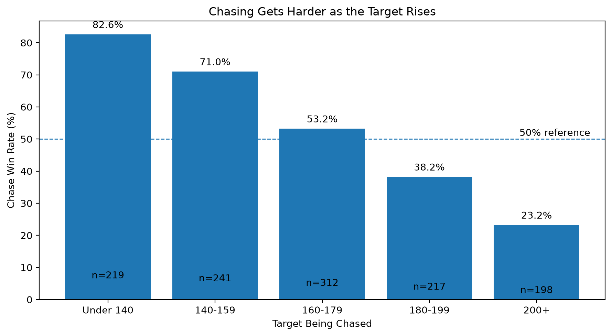
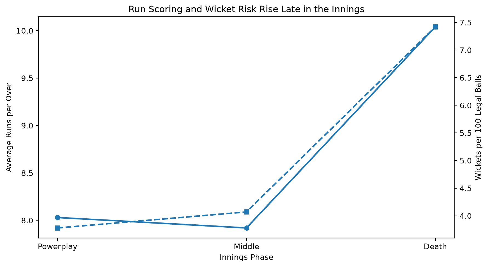
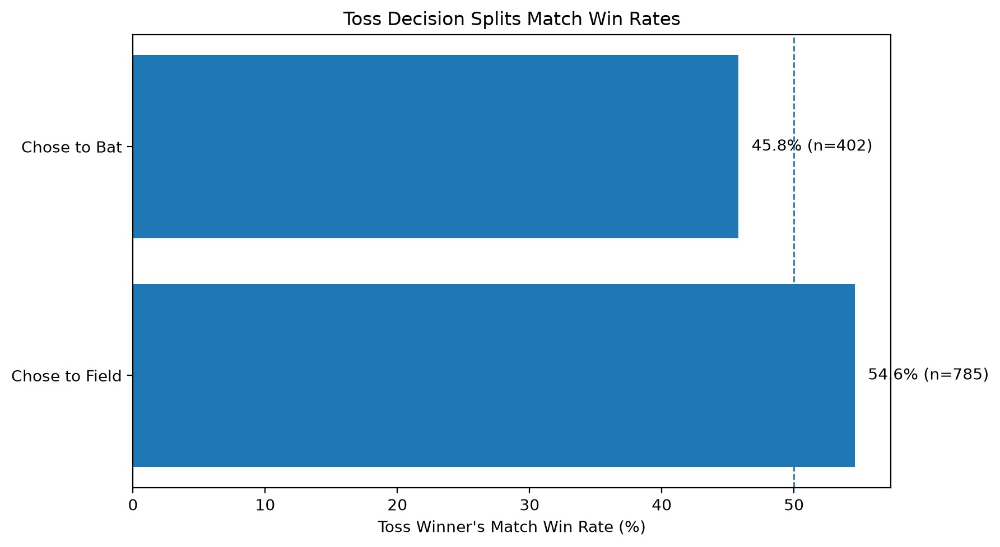
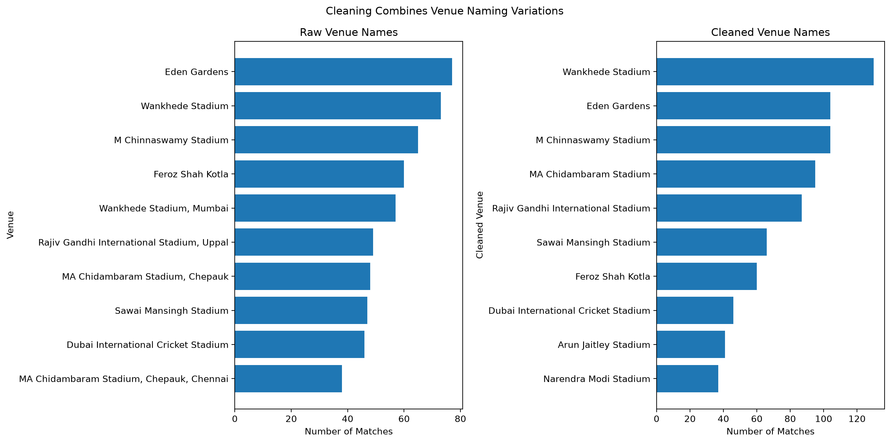

# IPL Cricket Analytics — Analysis Report

## Three Findings I Am Least Confident About

1. H2 — Chase win rate by target band
2. G3 — Toss decision split
3. I1 — Venue cleaning effect

---

## Scenario H2

**Question:** Does chase success change by target band?

**Number:** Chase win rate varies across the target bands.

**Population:** Completed IPL matches with a recorded first-innings total and defined chase result.

**Decision:** Higher targets should be treated as more difficult chasing situations.

**Doubt:** Target difficulty can also depend on venue, team strength, season and match conditions. Step 4 should test these effects.

---

## Scenario C1

**Question:** How do scoring rate and wicket risk change across innings phases?

**Number:** Runs per over and wickets per 100 legal balls are compared across Powerplay, Middle and Death phases.

**Population:** Legal deliveries included in the phase analysis.

**Decision:** Teams may need different batting and bowling approaches in the Death phase.

**Doubt:** Phase differences can be affected by batting order, match situation and team quality.

---

## Scenario G3

**Question:** Does the toss decision relate to match win rate?

**Number:** Match win rate is compared between toss winners who chose to bat and those who chose to field.

**Population:** Completed matches with a recorded toss decision and match winner.

**Decision:** Toss strategy can be considered alongside the match context rather than looking only at who won the toss.

**Doubt:** The relationship is observational and may be affected by venue, season, team strength and match conditions.

---

## Scenario I1

**Question:** Does venue cleaning change the apparent venue leaderboard?

**Number:** Raw venue names are compared with cleaned venue names.

**Population:** IPL matches with a recorded venue.

**Decision:** Cleaned venue names should be used when comparing venues.

**Doubt:** Cleaning depends on the mapping rules used to combine venue names.

---

## Scenario Specialism

**Question:** 

**Number:** 

**Population:** 

**Decision:** 

**Doubt:** 

---

## Final Note

The findings are descriptive. Further statistical validation should be used before treating the observed relationships as causal or universally predictive.
